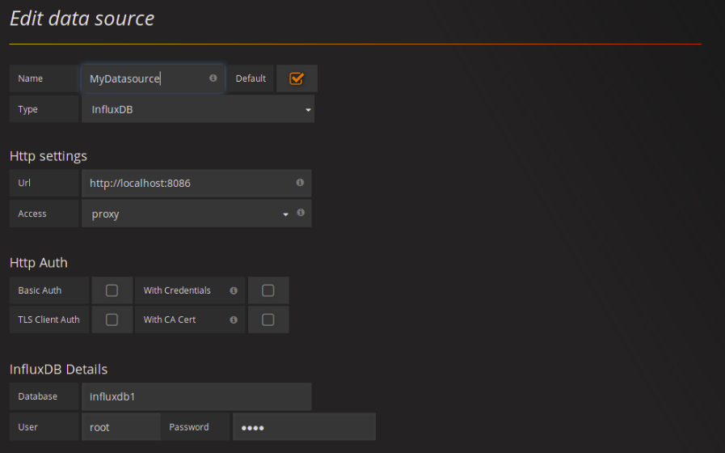
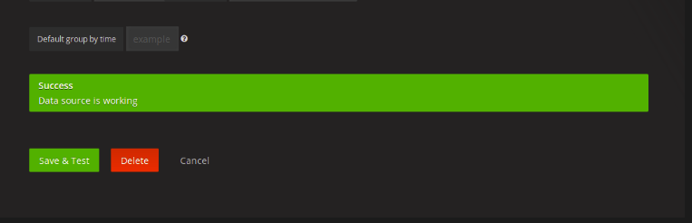
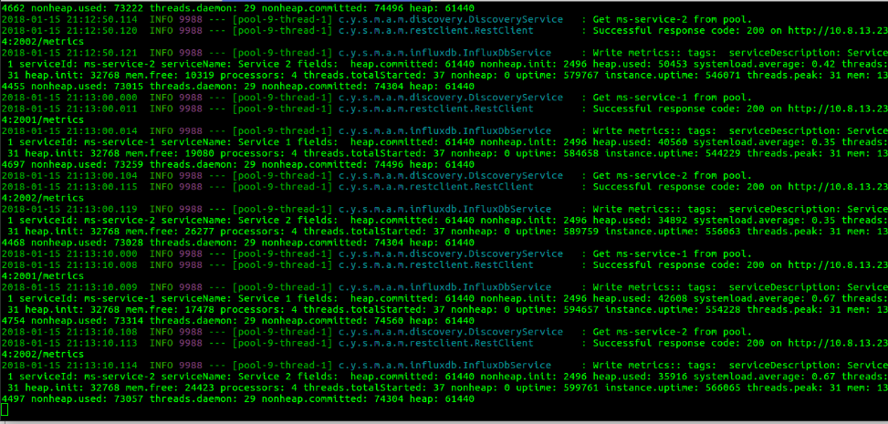
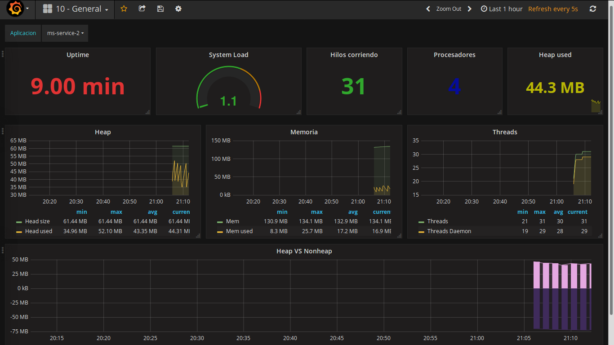
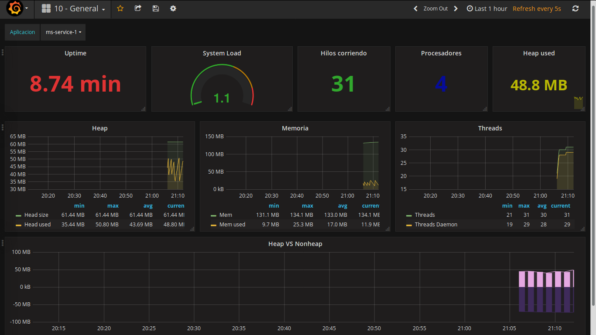

# spring-boot-metrics-to-influxdb
Project that allows to collect the metrics provided by the spring-actuator and send them to the InfluxDB time series database and monitor this data with Grafana.

## Install influxDB

The influexdb time series database must be installed, you can download the installer in the following link: [infludata](https://portal.influxdata.com/downloads). InfluxDB must be running through port 8086.

## Install and configure Grafana
The Grafana monitoring system must be downloaded and installed. You can download the installer in the following link: [grafana server](https://grafana.com/grafana/download).  Grafana server must be running through port 3000.

### Steps for configuration

* Configure the datasource.

*  Check the connection.

## Deploy services

----
$ cd spring-boot-metrics-to-influxdb \
$ mvn clean \
$ mvn install \
$ cd app.discovery.service/target \
$ java -XX:+UseG1GC -Xmx100m -Xms32m -jar app.discovery.service.jar \
$ cd microservice.service.2/target \
$ java -XX:+UseG1GC -Xmx50m -Xms32m -jar ms-service-2.jar \
$ cd microservice.service.1/target \
$ java -XX:+UseG1GC -Xmx70m -Xms32m -jar ms-service-1.jar \
$ cd app.metrics-to-influxdb.service/target \
$ java -XX:+UseG1GC -Xmx80m -Xms32m -jar app-metrics-to-influxdb.jar

----
When you start the app-metrics-to-influxdb.jar service you can see in the following image how the registered applications in Eureka Server are obtained and the metrics specified in the application.yml file are sent for InfluxDB. The connection data for InfluxDB as well as the services that you want your metrics to be monitored are specified in that same file.

## Data in graph

## Summary
 You can build multiple graphics, everything is in your imagination. Grafana is a really flexible tool and adapts to any need, I particularly prefer this solution before using spring boot dashboard. In the doc folder the dashborad is present, you only have to import it in Grafana and that's it.

